.. _performance_filesizes:

Performance Analysis of VersionedHDF5 Files: File sizes
=======================================================

For these tests, we have generated ``.h5`` data files using the
``generate_data.py`` script from the `VersionedHDF5
repository <https://github.com/deshaw/versioned-hdf5>`__, using the
standard options (:ref:`see more details in Performance<performance>`.)

We performed the following tests:

1. `Test Large Fraction Changes Sparse <#test-1-large-fraction-changes-sparse>`__
2. `Test Mostly Appends Sparse <#test-2-mostly-appends-sparse>`__
3. `Test Small Fraction Changes Sparse <#test-3-small-fraction-changes-sparse>`__
4. `Test Large Fraction Changes (Constant Array Size) Sparse <#test-4-large-fraction-changes-sparse-constant-size>`__
5. `Test Mostly Appends Dense <#test-5-mostly-appends-dense>`__

Setup
-----

.. code:: python

    import h5py
    import json
    import numpy as np
    import performance_tests
    import matplotlib.pyplot as plt

The information from the generated test files are stored in either

- ``testcase.tests``, a dictionary containing all the info related to a testcase that was run recently;
- a ``.json`` file named after the test name and options, containing a summary of the results. This file can be read with

.. code:: python

    with open("<filename>.json", "r") as json_in:
          test = json.load(json_in)

Test 1: Large fraction changes (sparse)
---------------------------------------

.. code:: python

    testname = "test_large_fraction_changes_sparse"

For the number of transactions, chunk sizes and compression algorithms, we tests the following options:

.. code:: python

   num_transactions_1 = [50, 100, 500, 1000, 5000]
   exponents_1 = [12, 14]
   compression_1 = [None, "gzip", "lzf"]

(note that chunk sizes are taken as power of 2, so an exponent of :math:`12` means that the chunk size is :math:`2^12` or 4096.)

If you want to generate your own tests, you can modify the appropriate constants
for the desired tests, and run them on the notebook included in the ``analysis`` directory of the VersionedHDF souces. **Please keep in mind that file sizes can become very large for large numbers of transactions (above 5000
transactions).**

Analysis
~~~~~~~~

First, let’s obtain some common parameters from the tests:

.. code:: python

    num_transactions = [test['num_transactions'] for test in testcase_1]
    chunk_sizes = [test['chunk_size'] for test in testcase_1]
    compression = [test['compression'] for test in testcase_1]
    filesizes = np.array([test['size'] for test in testcase_1])
    sizelabels = np.array([test['size_label'] for test in testcase_1])
    max_no_versions = max(np.array([test['size'] for test in testcase_1_no_versions]))

    n = len(set(num_transactions))
    ncs = len(set(chunk_sizes))
    ncomp = len(set(compression))

We’ll start by analyzing how the ``.h5`` file sizes grow as the number
of versions grows.

Note that the array size also can also grow as the number of versions
grows, since each transaction is changing the original arrays by adding,
deleting and changing values in the original arrays. In order to compute
a (naive) theoretical lower bound on the file size, we can compute how
much space each version should take. However, this does not account for
overhead and particular details of chunking. Keep in mind there is
redundant data as some of it is not changed during the staging of a new
version but it is still being stored.

Let’s show the size information in a plot. On the left, we can see a
linear plot, and on the right a loglog plot of the same size data for
``testcase_1``. On the bottom, a blue solid horizontal line indicates
the maximum file size obtained when generating the same tests with no
versioning (that is, not using VersionedHDF5).

.. code:: python

    fig, ax = plt.subplots(nrows=1, ncols=2, figsize=(20,8))

    # Changing the indices in selected will change the y-axis ticks in the graph for better visualization
    selected = [4, 5, 9, 10]

    for i in range(ncomp):
        start = i*ncs*n
        for j in range(ncs):
            ax[0].plot(num_transactions[:n],
                       filesizes[start+j*n:start+(j+1)*n],
                       '*--', ms=12,
                       label=f"Chunk size {chunk_sizes[start+j*n]}, {compression[start]}")
            ax[1].loglog(num_transactions[:n],
                         filesizes[start+j*n:start+(j+1)*n],
                         '*--', ms=12,
                         label=f"Chunk size {chunk_sizes[start+j*n]}, {compression[start]}")
            ax[0].legend(loc='upper left')
            ax[1].legend(loc='upper left')
            ax[0].minorticks_off()
            ax[1].minorticks_off()
            ax[0].set_xticks(num_transactions[:n])
            ax[0].set_xticklabels(num_transactions[:n])
            ax[0].set_yticks(filesizes[selected])
            ax[0].set_yticklabels(sizelabels[selected])
            ax[0].set_xlabel("Transactions")
            ax[0].grid(True)
            ax[1].set_xticks(num_transactions[:n])
            ax[1].set_xticklabels(num_transactions[:n])
            ax[1].set_yticks(filesizes[selected])
            ax[1].set_yticklabels(sizelabels[selected])
            ax[1].set_xlabel("Transactions")
            ax[1].grid(True)

    ax[0].axhline(max_no_versions)
    ax[1].axhline(max_no_versions)
    plt.suptitle(f"{testname}")
    plt.show()

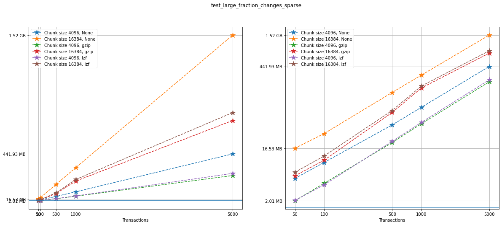

Comparing compression algorithms
~~~~~~~~~~~~~~~~~~~~~~~~~~~~~~~~

For each chunk size that we chose to test, let’s compare the file sizes
corresponding to each compression algorithm that we used.

.. code:: python

    fig, ax = plt.subplots(ncs, figsize=(10,10), sharey=True)
    fig.suptitle(f"{testname}: File sizes")

    for i in range(ncomp):
        start = i*ncs*n
        for j in range(ncs):
            ax[j].loglog(num_transactions[:n],
                         filesizes[start+j*n:start+(j+1)*n],
                         '*--', ms=12,
                         label=f"{compression[start]}")
            ax[j].legend(loc='upper left')
            ax[j].set_title(f"Chunk Size {chunk_sizes[start+j*n]}")
            ax[j].set_xticks(num_transactions[:n])
            ax[j].set_xticklabels(num_transactions[:n])
            ax[j].set_yticks(filesizes[selected])
            ax[j].set_yticklabels(sizelabels[selected])
            ax[j].grid(True)
            ax[j].minorticks_off()

    plt.xlabel("Transactions")
    plt.suptitle(f"{testname}")
    plt.show()

.. image:: Performance_tests-File_sizes_files/Performance_tests-File_sizes_37_0.png

Comparing chunk sizes
~~~~~~~~~~~~~~~~~~~~~

Now, for each choice of compression algorithm, we compare different
chunk sizes.

.. code:: python

    fig, ax = plt.subplots(ncomp, figsize=(10,10), sharey=True)
    fig.suptitle(f"{testname}: File sizes")

    for i in range(ncomp):
        start = i*ncs*n
        for j in range(ncs):
            plotlabel = f"Chunk size {chunk_sizes[start+j*n]}"
            plottitle = f"Compression: {compression[start]}"
            ax[i].loglog(num_transactions[:n],
                         filesizes[start+j*n:start+(j+1)*n],
                         '*--', ms=12,
                         label=plotlabel)
            ax[i].legend(loc='upper left')
            ax[i].set_title(plottitle)
            ax[i].set_xticks(num_transactions[:n])
            ax[i].set_xticklabels(num_transactions[:n])
            ax[i].set_yticks(filesizes[selected])
            ax[i].set_yticklabels(sizelabels[selected])
            ax[i].grid(True)
            ax[i].minorticks_off()

    plt.xlabel("Transactions")
    plt.suptitle(f"{testname}")
    plt.show()

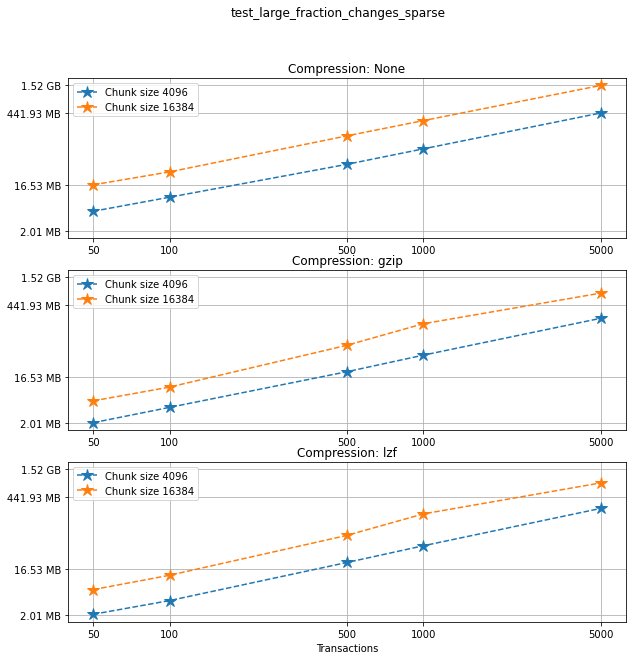

Creation times
~~~~~~~~~~~~~~

If we look at the creation times for these files, we have something like
this:

.. code:: python

    t_write = np.array([test['t_write'][-1] for test in testcase_1])
    fig_large_fraction_changes_times = plt.figure(figsize=(10,8))
    for i in range(ncomp):
        start = i*ncs*n
        for j in range(ncs):
            plt.plot(num_transactions[:n],
                     t_write[start+j*n:start+(j+1)*n],
                     'o--', ms=8,
                     label=f"Chunk size {chunk_sizes[start+j*n]}, {compression[start]}")

    # If you also with to plot information about the "no versions" test,
    # run the following lines:
    t_write_nv = np.array([test['t_write'][-1] for test in testcase_1_no_versions])
    for i in range(ncomp):
        start = i*ncs*n
        for j in range(ncs):
            plt.plot(num_transactions[:n],
                     t_write_nv[start+j*n:start+(j+1)*n],
                     '*-', ms=12,
                     label=f"Chunk size {chunk_sizes[start+j*n]}, {compression[start]}, No versioning")

    plt.xlabel("Transactions")
    plt.title(f"{testname} - creation times in seconds")
    plt.legend()
    plt.xticks(num_transactions[:n])
    plt.show()

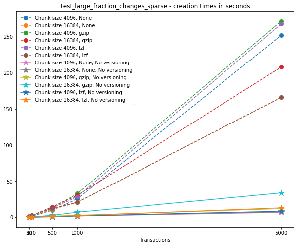

Now, we can look at the time required to stage a new version in the
file, that is, to add a new transaction. The graphs below show, for each
fixed number of transactions, the time required to add new versions as
the file is created.

.. code:: python

    fig_times, ax = plt.subplots(n+1, figsize=(14,20))
    fig_times.suptitle(f"{testname}: time to write each new version")

    for i in range(n):
        for test in testcase_1:
            if test['num_transactions'] == num_transactions[i]:
                t_write = np.array(test['t_write'][:-1])
                ax[i].plot(t_write,
                           label=f"chunk size {test['chunk_size']}, {test['compression']}")
                ax[i].legend(loc='upper left')

    # If you also with to plot information about the "no versions" test,
    # run the following lines:
    for test in testcase_1_no_versions:
        if test['num_transactions'] == num_transactions[i]:
            t_write = np.array(test['t_write'][:-1])
            ax[n].plot(t_write,
                       label=f"chunk size {test['chunk_size']}, {test['compression']}")
            ax[n].legend(loc='upper left')
            ax[n].set_title('No versioning')

    plt.xlabel("Number of transactions")
    plt.ylabel("Time (in seconds)")
    plt.show()

.. image:: Performance_tests-File_sizes_files/Performance_tests-File_sizes_45_0.png

Summary
~~~~~~~

We can clearly see that files with smallest file size, corresponding to
smaller chunk sizes, are also the ones with largest creation times.
**This is consistent with the effects of using smaller chunk sizes in
HDF5 files.**

This behaviour suggests that for ``test_large_fraction_changes_sparse``,
larger chunk sizes generate larger files, but the size of the files
grows as expected as the number of transactions grow. So, **if we are
dealing with a large number of transactions, larger chunk sizes generate
files that are larger while having faster creation times** (and probably
faster read/write speeds as well).

Test 2: Mostly appends (sparse)
-------------------------------

.. code:: python

    testname = "test_mostly_appends_sparse"

For this case, we have tested the following options:

.. code:: python

   num_transactions_2 = [25, 50, 100, 500]
   exponents_2 = [12, 14]
   compression_2 = [None, "gzip", "lzf"]

Analysis
~~~~~~~~

Repeating the same analysis as in the previous test, let’s show the size
information in a graph:

.. code:: python

    num_transactions = [test['num_transactions'] for test in testcase_2]
    chunk_sizes = [test['chunk_size'] for test in testcase_2]
    compression = [test['compression'] for test in testcase_2]
    filesizes = np.array([test['size'] for test in testcase_2])
    sizelabels = np.array([test['size_label'] for test in testcase_2])
    max_no_versions = max(np.array([test['size'] for test in testcase_2_no_versions]))

    n = len(set(num_transactions))
    ncs = len(set(chunk_sizes))
    ncomp = len(set(compression))

Similarly to what we did before, on the left we can see a linear plot,
and on the right a loglog plot of the same size data for ``testcase_2``.
A blue solid horizontal line indicates the maximum file size obtained
when generating the same tests with no versioning (that is, not using
VersionedHDF5).

.. code:: python

    fig, ax = plt.subplots(nrows=1, ncols=2, figsize=(20,8))

    selected = [4, 5, 9, 10]

    for i in range(ncomp):
        start = i*ncs*n
        for j in range(ncs):
            ax[0].plot(num_transactions[:n],
                       filesizes[start+j*n:start+(j+1)*n],
                       '*--', ms=12,
                       label=f"Chunk size {chunk_sizes[start+j*n]}, {compression[start]}")
            ax[1].loglog(num_transactions[:n],
                         filesizes[start+j*n:start+(j+1)*n],
                         '*--', ms=12,
                         label=f"Chunk size {chunk_sizes[start+j*n]}, {compression[start]}")
            ax[0].legend(loc='upper left')
            ax[1].legend(loc='upper left')
            ax[0].minorticks_off()
            ax[1].minorticks_off()
            # Changing the indices in selected will change the y-axis ticks in the graph for better visualization
            ax[0].set_xticks(num_transactions[:n])
            ax[0].set_xticklabels(num_transactions[:n])
            ax[0].set_yticks(filesizes[selected])
            ax[0].set_yticklabels(sizelabels[selected])
            ax[0].set_xlabel("Transactions")
            ax[0].grid(True)
            ax[1].set_xticks(num_transactions[:n])
            ax[1].set_xticklabels(num_transactions[:n])
            ax[1].set_yticks(filesizes[selected])
            ax[1].set_yticklabels(sizelabels[selected])
            ax[1].set_xlabel("Transactions")
            ax[1].grid(True)

    ax[0].axhline(max_no_versions)
    ax[1].axhline(max_no_versions)
    plt.suptitle(f"{testname}")
    plt.show()

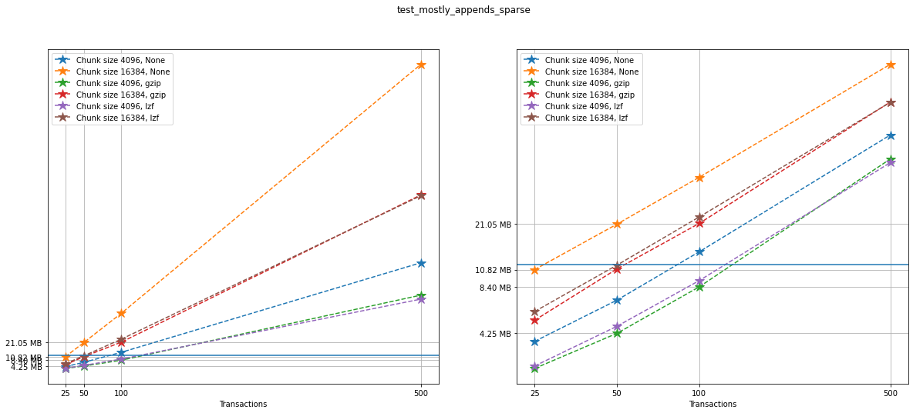

Comparing compression algorithms
~~~~~~~~~~~~~~~~~~~~~~~~~~~~~~~~

For each chunk size that we chose to test, let’s compare the file sizes
corresponding to each compression algorithm that we used.

.. code:: python

    fig, ax = plt.subplots(ncs, figsize=(10,10), sharey=True)
    fig.suptitle(f"{testname}: File sizes")

    for i in range(ncomp):
        start = i*ncs*n
        for j in range(ncs):
            ax[j].loglog(num_transactions[:n],
                         filesizes[start+j*n:start+(j+1)*n],
                         '*--', ms=12,
                         label=f"{compression[start]}")
            ax[j].legend(loc='upper left')
            ax[j].set_title(f"Chunk Size {chunk_sizes[start+j*n]}")
            ax[j].set_xticks(num_transactions[:n])
            ax[j].set_xticklabels(num_transactions[:n])
            ax[j].set_yticks(filesizes[selected])
            ax[j].set_yticklabels(sizelabels[selected])
            ax[j].grid(True)
            ax[j].minorticks_off()

    plt.xlabel("Transactions")
    plt.suptitle(f"{testname}")
    plt.show()

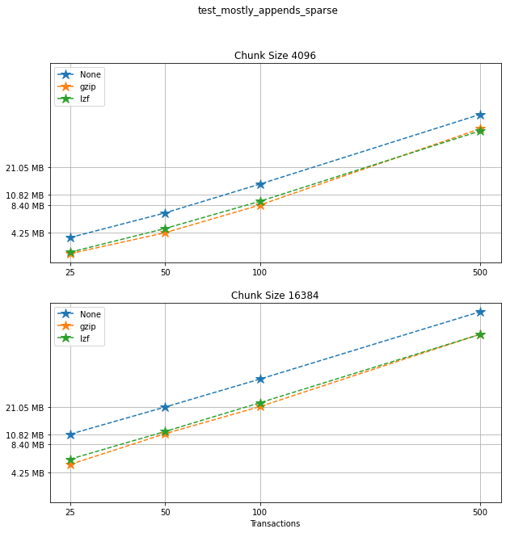

Comparing chunk sizes
~~~~~~~~~~~~~~~~~~~~~

Now, for each choice of compression algorithm, we compare different
chunk sizes.

.. code:: python

    fig, ax = plt.subplots(ncomp, figsize=(10,10), sharey=True)
    fig.suptitle(f"{testname}: File sizes")

    for i in range(ncomp):
        start = i*ncs*n
        for j in range(ncs):
            plotlabel = f"Chunk size {chunk_sizes[start+j*n]}"
            plottitle = f"Compression: {compression[start]}"
            ax[i].loglog(num_transactions[:n],
                         filesizes[start+j*n:start+(j+1)*n],
                         '*--', ms=12,
                         label=plotlabel)
            ax[i].legend(loc='upper left')
            ax[i].set_title(plottitle)
            ax[i].set_xticks(num_transactions[:n])
            ax[i].set_xticklabels(num_transactions[:n])
            ax[i].set_yticks(filesizes[selected])
            ax[i].set_yticklabels(sizelabels[selected])
            ax[i].grid(True)
            ax[i].minorticks_off()

    plt.xlabel("Transactions")
    plt.suptitle(f"{testname}")
    plt.show()

.. image:: Performance_tests-File_sizes_files/Performance_tests-File_sizes_76_0.png

Creation times
~~~~~~~~~~~~~~

The creation times for each file are as follows.

.. code:: python

    t_write = np.array([test['t_write'][-1] for test in testcase_2])
    fig_large_fraction_changes_times = plt.figure(figsize=(10,8))
    for i in range(ncomp):
        start = i*ncs*n
        for j in range(ncs):
            plt.plot(num_transactions[:n],
                     t_write[start+j*n:start+(j+1)*n],
                     'o--', ms=8,
                     label=f"Chunk size {chunk_sizes[start+j*n]}, {compression[start]}")

    # If you also with to plot information about the "no versions" test,
    # run the following lines:
    t_write_nv = np.array([test['t_write'][-1] for test in testcase_2_no_versions])
    for i in range(ncomp):
        start = i*ncs*n
        for j in range(ncs):
            plt.plot(num_transactions[:n],
                     t_write_nv[start+j*n:start+(j+1)*n],
                     '*-', ms=12,
                     label=f"Chunk size {chunk_sizes[start+j*n]}, {compression[start]}, No versioning")

    plt.xlabel("Transactions")
    plt.title(f"{testname} - creation times in seconds")
    plt.legend()
    plt.xticks(num_transactions[:n])
    plt.show()

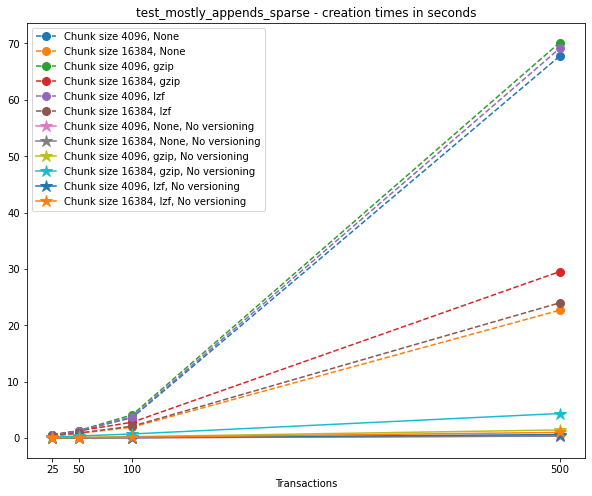

Again, the graphs below show, for each fixed number of transactions, the
time required to add new versions as the file is created.

.. code:: python

    fig_times, ax = plt.subplots(n+1, figsize=(14,20))
    fig_times.suptitle(f"{testname}: time to write each new version")

    for i in range(n):
        for test in testcase_2:
            if test['num_transactions'] == num_transactions[i]:
                t_write = np.array(test['t_write'][:-1])
                ax[i].plot(t_write,
                           label=f"chunk size {test['chunk_size']}, {test['compression']}")
                ax[i].legend(loc='upper left')

    # If you also with to plot information about the "no versions" test,
    # run the following lines:
    for test in testcase_2_no_versions:
        if test['num_transactions'] == num_transactions[i]:
            t_write = np.array(test['t_write'][:-1])
            ax[n].plot(t_write,
                       label=f"chunk size {test['chunk_size']}, {test['compression']}")
            ax[n].legend(loc='upper left')
            ax[n].set_title('No versioning')

    plt.xlabel("Number of transactions")
    plt.ylabel("Time (in seconds)")
    plt.show()

.. image:: Performance_tests-File_sizes_files/Performance_tests-File_sizes_81_0.png

Summary
~~~~~~~

In this test, we can see that creation times are higher, which is
expected since the arrays in the dataset grow significantly in size from
one version to the next. Again, smaller chunk sizes correspond to
smaller file sizes, but larger creation times. However, in this case, we
can see there is a drop in performance when adding new versions as our
file grows. This can be seen as an effect of the increase in the data
size for each new version (since we are *mostly appending* data with
each new version) but **can’t be explained by that alone**, as evidenced
by the difference in scale between creation times for the versioned and
non-versioned cases.

Test 3: Small fraction changes (sparse)
---------------------------------------

.. code:: python

    testname = "test_small_fraction_changes_sparse"

We have tested the following options:

.. code:: python

   num_transactions_3 = [50, 100, 500, 1000, 5000]
   exponents_3 = [12, 14]
   compression_3 = [None, "gzip", "lzf"]

Analysis
~~~~~~~~

Again, let’s show the size information in a graph:

.. code:: python

    num_transactions = [test['num_transactions'] for test in testcase_3]
    chunk_sizes = [test['chunk_size'] for test in testcase_3]
    compression = [test['compression'] for test in testcase_3]
    filesizes = np.array([test['size'] for test in testcase_3])
    sizelabels = np.array([test['size_label'] for test in testcase_3])
    max_no_versions = max(np.array([test['size'] for test in testcase_3_no_versions]))

    n = len(set(num_transactions))
    ncs = len(set(chunk_sizes))
    ncomp = len(set(compression))

Again, on the left we can see a linear plot, and on the right a loglog
plot of the same size data for ``testcase_3``. A blue solid horizontal
line indicates the maximum file size obtained when generating the same
tests with no versioning (that is, not using VersionedHDF5).

.. code:: python

    fig, ax = plt.subplots(nrows=1, ncols=2, figsize=(20,8))

    # Changing the indices in selected will change the y-axis ticks in the graph for better visualization
    selected = [0, 3, 4, 9, 19]

    for i in range(ncomp):
        start = i*ncs*n
        for j in range(ncs):
            ax[0].plot(num_transactions[:n],
                       filesizes[start+j*n:start+(j+1)*n],
                       '*--', ms=12,
                       label=f"Chunk size {chunk_sizes[start+j*n]}, {compression[start]}")
            ax[1].loglog(num_transactions[:n],
                         filesizes[start+j*n:start+(j+1)*n],
                         '*--', ms=12,
                         label=f"Chunk size {chunk_sizes[start+j*n]}, {compression[start]}")
            ax[0].legend(loc='upper left')
            ax[1].legend(loc='upper left')
            ax[0].minorticks_off()
            ax[1].minorticks_off()
            ax[0].set_xticks(num_transactions[:n])
            ax[0].set_xticklabels(num_transactions[:n])
            ax[0].set_yticks(filesizes[selected])
            ax[0].set_yticklabels(sizelabels[selected])
            ax[0].set_xlabel("Transactions")
            ax[0].grid(True)
            ax[1].set_xticks(num_transactions[:n])
            ax[1].set_xticklabels(num_transactions[:n])
            ax[1].set_yticks(filesizes[selected])
            ax[1].set_yticklabels(sizelabels[selected])
            ax[1].set_xlabel("Transactions")
            ax[1].grid(True)

    ax[0].axhline(max_no_versions)
    ax[1].axhline(max_no_versions)
    plt.suptitle(f"{testname}")
    plt.show()

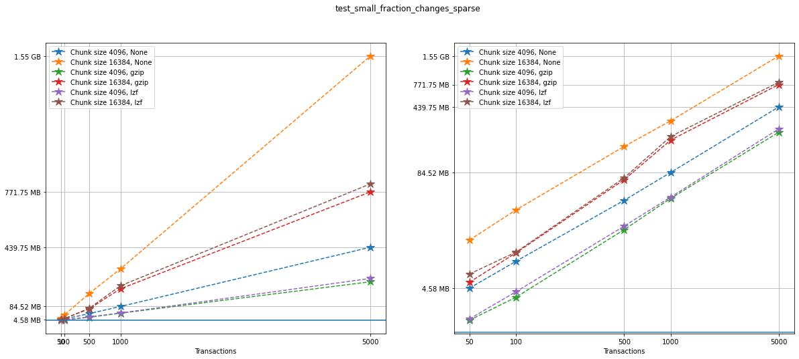

Comparing compression algorithms
~~~~~~~~~~~~~~~~~~~~~~~~~~~~~~~~

For each chunk size that we chose to test, let’s compare the file sizes
corresponding to each compression algorithm that we used.

.. code:: python

    fig, ax = plt.subplots(ncs, figsize=(10,10), sharey=True)
    fig.suptitle(f"{testname}: File sizes")

    for i in range(ncomp):
        start = i*ncs*n
        for j in range(ncs):
            ax[j].loglog(num_transactions[:n],
                         filesizes[start+j*n:start+(j+1)*n],
                         '*--', ms=12,
                         label=f"{compression[start]}")
            ax[j].legend(loc='upper left')
            ax[j].set_title(f"Chunk Size {chunk_sizes[start+j*n]}")
            ax[j].set_xticks(num_transactions[:n])
            ax[j].set_xticklabels(num_transactions[:n])
            ax[j].set_yticks(filesizes[selected])
            ax[j].set_yticklabels(sizelabels[selected])
            ax[j].grid(True)
            ax[j].minorticks_off()

    plt.xlabel("Transactions")
    plt.suptitle(f"{testname}")
    plt.show()

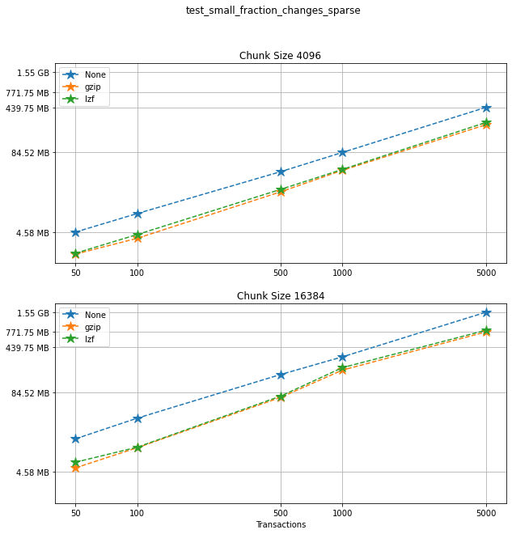

Comparing chunk sizes
~~~~~~~~~~~~~~~~~~~~~

Now, for each choice of compression algorithm, we compare different
chunk sizes.

.. code:: python

    fig, ax = plt.subplots(ncomp, figsize=(10,10), sharey=True)
    fig.suptitle(f"{testname}: File sizes")

    for i in range(ncomp):
        start = i*ncs*n
        for j in range(ncs):
            plotlabel = f"Chunk size {chunk_sizes[start+j*n]}"
            plottitle = f"Compression: {compression[start]}"
            ax[i].loglog(num_transactions[:n],
                         filesizes[start+j*n:start+(j+1)*n],
                         '*--', ms=12,
                         label=plotlabel)
            ax[i].legend(loc='upper left')
            ax[i].set_title(plottitle)
            ax[i].set_xticks(num_transactions[:n])
            ax[i].set_xticklabels(num_transactions[:n])
            ax[i].set_yticks(filesizes[selected])
            ax[i].set_yticklabels(sizelabels[selected])
            ax[i].grid(True)
            ax[i].minorticks_off()

    plt.xlabel("Transactions")
    plt.suptitle(f"{testname}")
    plt.show()

.. image:: Performance_tests-File_sizes_files/Performance_tests-File_sizes_111_0.png

Creation times
~~~~~~~~~~~~~~

If we look at the creation times for these files, we have something like
this:

.. code:: python

    t_write = np.array([test['t_write'][-1] for test in testcase_3])
    fig_large_fraction_changes_times = plt.figure(figsize=(10,8))
    for i in range(ncomp):
        start = i*ncs*n
        for j in range(ncs):
            plt.plot(num_transactions[:n],
                     t_write[start+j*n:start+(j+1)*n],
                     'o--', ms=8,
                     label=f"Chunk size {chunk_sizes[start+j*n]}, {compression[start]}")

    # If you also with to plot information about the "no versions" test,
    # run the following lines:
    t_write_nv = np.array([test['t_write'][-1] for test in testcase_3_no_versions])
    for i in range(ncomp):
        start = i*ncs*n
        for j in range(ncs):
            plt.plot(num_transactions[:n],
                     t_write_nv[start+j*n:start+(j+1)*n],
                     '*-', ms=12,
                     label=f"Chunk size {chunk_sizes[start+j*n]}, {compression[start]}, No versioning")

    plt.xlabel("Transactions")
    plt.title(f"{testname} - creation times in seconds")
    plt.legend()
    plt.xticks(num_transactions[:n])
    plt.show()

.. image:: Performance_tests-File_sizes_files/Performance_tests-File_sizes_114_0.png

Again, the graphs below show, for each fixed number of transactions, the
time required to add new versions as the file is created.

.. code:: python

    fig_times, ax = plt.subplots(n+1, figsize=(14,20))
    fig_times.suptitle(f"{testname}: time to write each new version")

    for i in range(n):
        for test in testcase_3:
            if test['num_transactions'] == num_transactions[i]:
                t_write = np.array(test['t_write'][:-1])
                ax[i].plot(t_write,
                           label=f"chunk size {test['chunk_size']}, {test['compression']}")
                ax[i].legend(loc='upper left')

    # If you also with to plot information about the "no versions" test,
    # run the following lines:
    for test in testcase_3_no_versions:
        if test['num_transactions'] == num_transactions[i]:
            t_write = np.array(test['t_write'][:-1])
            ax[n].plot(t_write,
                       label=f"chunk size {test['chunk_size']}, {test['compression']}")
            ax[n].legend(loc='upper left')
            ax[n].set_title('No versioning')

    plt.xlabel("Number of transactions")
    plt.ylabel("Time (in seconds)")
    plt.show()

.. image:: Performance_tests-File_sizes_files/Performance_tests-File_sizes_116_0.png

Summary
~~~~~~~

This behaviour is very similar to what we got in the
``test_large_fraction_changes_sparse`` case, with the exception that the
times required to write new versions to the file are on average smaller
than those in the former case. This is expected both in the versioned
and unversioned case.

Test 4: Large fraction changes - constant array size (sparse)
-------------------------------------------------------------

.. code:: python

    testname = "test_large_fraction_constant_sparse"

We have tested the following options:

.. code:: python

   num_transactions_4 = [50, 100, 500, 1000, 5000]
   exponents_4 = [12, 14]
   compression_4 = [None, "gzip", "lzf"]

Analysis
~~~~~~~~

Again, let’s show the size information in a graph:

.. code:: python

    num_transactions = [test['num_transactions'] for test in testcase_4]
    chunk_sizes = [test['chunk_size'] for test in testcase_4]
    compression = [test['compression'] for test in testcase_4]
    filesizes = np.array([test['size'] for test in testcase_4])
    sizelabels = np.array([test['size_label'] for test in testcase_4])
    max_no_versions = max(np.array([test['size'] for test in testcase_4_no_versions]))

    n = len(set(num_transactions))
    ncs = len(set(chunk_sizes))
    ncomp = len(set(compression))

Again, on the left we can see a linear plot, and on the right a loglog
plot of the same size data for ``testcase_4``. A blue solid horizontal
line indicates the maximum file size obtained when generating the same
tests with no versioning (that is, not using VersionedHDF5).

.. code:: python

    fig, ax = plt.subplots(nrows=1, ncols=2, figsize=(20,8))

    selected = [10, 4, 7, 9, 10, 19]

    for i in range(ncomp):
        start = i*ncs*n
        for j in range(ncs):
            ax[0].plot(num_transactions[:n],
                       filesizes[start+j*n:start+(j+1)*n],
                       '*--', ms=12,
                       label=f"Chunk size {chunk_sizes[start+j*n]}, {compression[start]}")
            ax[1].loglog(num_transactions[:n],
                         filesizes[start+j*n:start+(j+1)*n],
                         '*--', ms=12,
                         label=f"Chunk size {chunk_sizes[start+j*n]}, {compression[start]}")
            ax[0].legend(loc='upper left')
            ax[1].legend(loc='upper left')
            ax[0].minorticks_off()
            ax[1].minorticks_off()
            # Changing the indices in selected will change the y-axis ticks in the graph for better visualization
            ax[0].set_xticks(num_transactions[:n])
            ax[0].set_xticklabels(num_transactions[:n])
            ax[0].set_yticks(filesizes[selected])
            ax[0].set_yticklabels(sizelabels[selected])
            ax[0].set_xlabel("Transactions")
            ax[0].grid(True)
            ax[1].set_xticks(num_transactions[:n])
            ax[1].set_xticklabels(num_transactions[:n])
            ax[1].set_yticks(filesizes[selected])
            ax[1].set_yticklabels(sizelabels[selected])
            ax[1].set_xlabel("Transactions")
            ax[1].grid(True)

    ax[0].axhline(max_no_versions)
    ax[1].axhline(max_no_versions)
    plt.suptitle(f"{testname}")
    plt.show()

.. image:: Performance_tests-File_sizes_files/Performance_tests-File_sizes_140_0.png

Comparing compression algorithms
~~~~~~~~~~~~~~~~~~~~~~~~~~~~~~~~

For each chunk size that we chose to test, let’s compare the file sizes
corresponding to each compression algorithm that we used.

.. code:: python

    fig, ax = plt.subplots(ncs, figsize=(10,10), sharey=True)
    fig.suptitle(f"{testname}: File sizes")

    for i in range(ncomp):
        start = i*ncs*n
        for j in range(ncs):
            ax[j].loglog(num_transactions[:n],
                         filesizes[start+j*n:start+(j+1)*n],
                         '*--', ms=12,
                         label=f"{compression[start]}")
            ax[j].legend(loc='upper left')
            ax[j].set_title(f"Chunk Size {chunk_sizes[start+j*n]}")
            ax[j].set_xticks(num_transactions[:n])
            ax[j].set_xticklabels(num_transactions[:n])
            ax[j].set_yticks(filesizes[selected])
            ax[j].set_yticklabels(sizelabels[selected])
            ax[j].grid(True)
            ax[j].minorticks_off()

    plt.xlabel("Transactions")
    plt.suptitle(f"{testname}")
    plt.show()

.. image:: Performance_tests-File_sizes_files/Performance_tests-File_sizes_143_0.png

Comparing chunk sizes
~~~~~~~~~~~~~~~~~~~~~

Now, for each choice of compression algorithm, we compare different
chunk sizes.

.. code:: python

    fig, ax = plt.subplots(ncomp, figsize=(10,10), sharey=True)
    fig.suptitle(f"{testname}: File sizes")

    for i in range(ncomp):
        start = i*ncs*n
        for j in range(ncs):
            plotlabel = f"Chunk size {chunk_sizes[start+j*n]}"
            plottitle = f"Compression: {compression[start]}"
            ax[i].loglog(num_transactions[:n],
                         filesizes[start+j*n:start+(j+1)*n],
                         '*--', ms=12,
                         label=plotlabel)
            ax[i].legend(loc='upper left')
            ax[i].set_title(plottitle)
            ax[i].set_xticks(num_transactions[:n])
            ax[i].set_xticklabels(num_transactions[:n])
            ax[i].set_yticks(filesizes[selected])
            ax[i].set_yticklabels(sizelabels[selected])
            ax[i].grid(True)
            ax[i].minorticks_off()

    plt.xlabel("Transactions")
    plt.suptitle(f"{testname}")
    plt.show()

.. image:: Performance_tests-File_sizes_files/Performance_tests-File_sizes_146_0.png

Creation times
~~~~~~~~~~~~~~

If we look at the creation times for these files, we have something like
this:

.. code:: python

    t_write = np.array([test['t_write'][-1] for test in testcase_4])
    fig_large_fraction_changes_times = plt.figure(figsize=(10,8))
    for i in range(ncomp):
        start = i*ncs*n
        for j in range(ncs):
            plt.plot(num_transactions[:n],
                     t_write[start+j*n:start+(j+1)*n],
                     'o--', ms=8,
                     label=f"Chunk size {chunk_sizes[start+j*n]}, {compression[start]}")

    # If you also with to plot information about the "no versions" test,
    # run the following lines:
    t_write_nv = np.array([test['t_write'][-1] for test in testcase_4_no_versions])
    for i in range(ncomp):
        start = i*ncs*n
        for j in range(ncs):
            plt.plot(num_transactions[:n],
                     t_write_nv[start+j*n:start+(j+1)*n],
                     '*-', ms=12,
                     label=f"Chunk size {chunk_sizes[start+j*n]}, {compression[start]}, No versioning")

    plt.xlabel("Transactions")
    plt.title(f"{testname} - creation times in seconds")
    plt.legend()
    plt.xticks(num_transactions[:n])
    plt.show()

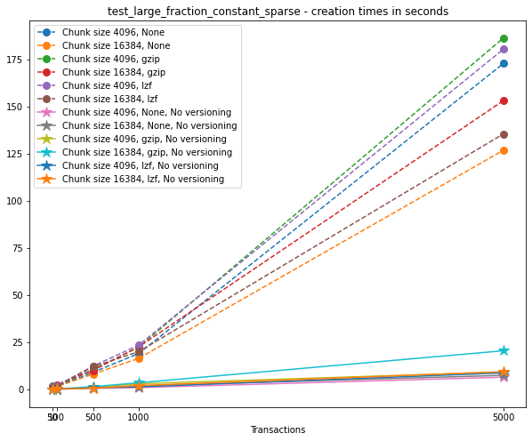

Again, the graphs below show, for each fixed number of transactions, the
time required to add new versions as the file is created.

.. code:: python

    fig_times, ax = plt.subplots(n+1, figsize=(14,20))
    fig_times.suptitle(f"{testname}: time to write each new version")

    for i in range(n):
        for test in testcase_4:
            if test['num_transactions'] == num_transactions[i]:
                t_write = np.array(test['t_write'][:-1])
                ax[i].plot(t_write,
                           label=f"chunk size {test['chunk_size']}, {test['compression']}")
                ax[i].legend(loc='upper left')

    # If you also with to plot information about the "no versions" test,
    # run the following lines:
    for test in testcase_4_no_versions:
        if test['num_transactions'] == num_transactions[i]:
            t_write = np.array(test['t_write'][:-1])
            ax[n].plot(t_write,
                       label=f"chunk size {test['chunk_size']}, {test['compression']}")
            ax[n].legend(loc='upper left')
            ax[n].set_title('No versioning')

    plt.xlabel("Number of transactions")
    plt.ylabel("Time (in seconds)")
    plt.show()

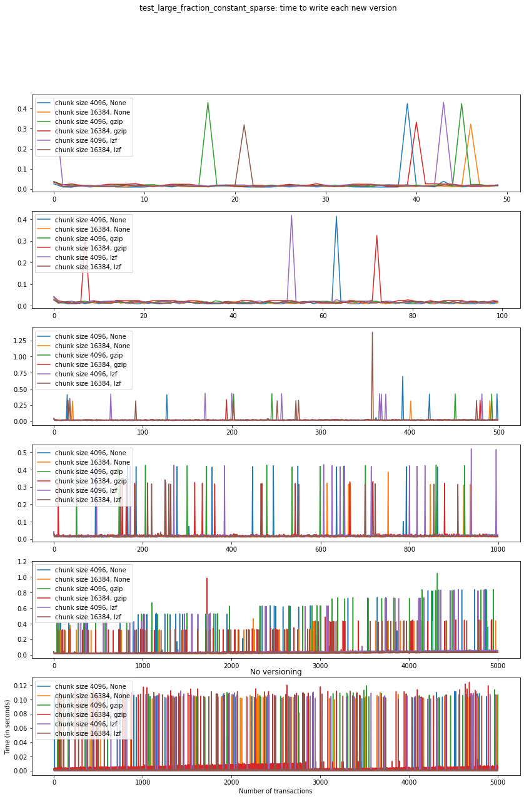

This behaviour is again very similar to ``test_large_fraction_changes``,
except that we don’t see the tendency to have larger times required to
add new versions as the number of transactions grows.

Test 5: Mostly appends (dense)
------------------------------

.. code:: python

    testname = "test_mostly_appends_dense"

**Note that this case includes a two-dimensional dataset.** For this
reason, we have chosen different chunk sizes to test, considering that
larger chunk sizes increase file sizes considerably in this case.

For this case, we have tested the following options:

.. code:: python

   num_transactions_5 = [25, 50, 100, 500]
   exponents_5 = [6, 8, 10]
   compression_5 = [None, "gzip", "lzf"]

Analysis
~~~~~~~~

Let’s show the size information in a graph:

.. code:: python

    num_transactions = [test['num_transactions'] for test in testcase_5]
    chunk_sizes = [test['chunk_size'] for test in testcase_5]
    compression = [test['compression'] for test in testcase_5]
    filesizes = np.array([test['size'] for test in testcase_5])
    sizelabels = np.array([test['size_label'] for test in testcase_5])
    max_no_versions = max(np.array([test['size'] for test in testcase_5_no_versions]))

    n = len(set(num_transactions))
    ncs = len(set(chunk_sizes))
    ncomp = len(set(compression))

Once more, on the left we can see a linear plot, and on the right a
loglog plot of the same size data for ``testcase_5``. A blue solid
horizontal line indicates the maximum file size obtained when generating
the same tests with no versioning (that is, not using VersionedHDF5).

.. code:: python

    fig, ax = plt.subplots(nrows=1, ncols=2, figsize=(20,8))

    selected = [6, 7, 10, 11, 12]

    for i in range(ncomp):
        start = i*ncs*n
        for j in range(ncs):
            ax[0].plot(num_transactions[:n],
                       filesizes[start+j*n:start+(j+1)*n],
                       '*--', ms=12,
                       label=f"Chunk size {chunk_sizes[start+j*n]}, {compression[start]}")
            ax[1].loglog(num_transactions[:n],
                         filesizes[start+j*n:start+(j+1)*n],
                         '*--', ms=12,
                         label=f"Chunk size {chunk_sizes[start+j*n]}, {compression[start]}")
            ax[0].legend(loc='upper left')
            ax[1].legend(loc='upper left')
            ax[0].minorticks_off()
            ax[1].minorticks_off()
            # Changing the indices in selected will change the y-axis ticks in the graph for better visualization
            ax[0].set_xticks(num_transactions[:n])
            ax[0].set_xticklabels(num_transactions[:n])
            ax[0].set_yticks(filesizes[selected])
            ax[0].set_yticklabels(sizelabels[selected])
            ax[0].set_xlabel("Transactions")
            ax[0].grid(True)
            ax[1].set_xticks(num_transactions[:n])
            ax[1].set_xticklabels(num_transactions[:n])
            ax[1].set_yticks(filesizes[selected])
            ax[1].set_yticklabels(sizelabels[selected])
            ax[1].set_xlabel("Transactions")
            ax[1].grid(True)

    ax[0].axhline(max_no_versions)
    ax[1].axhline(max_no_versions)
    plt.suptitle(f"{testname}")
    plt.show()

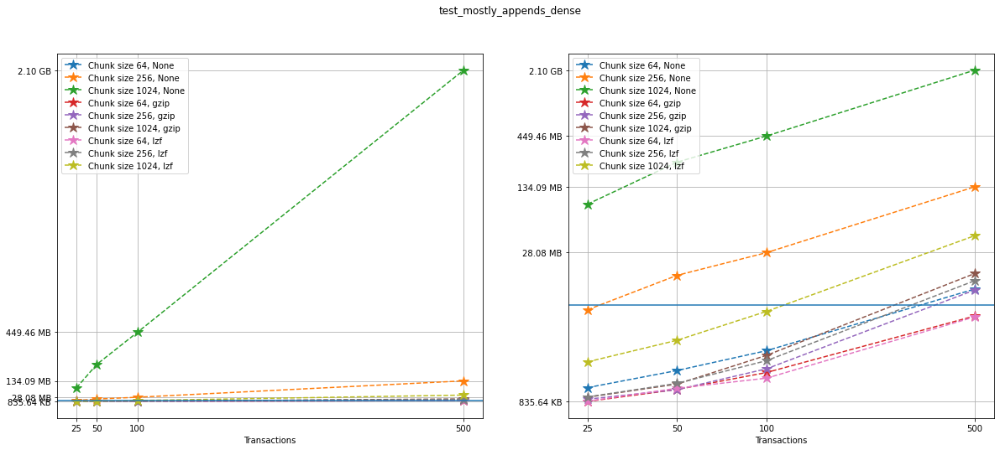

Comparing compression algorithms
~~~~~~~~~~~~~~~~~~~~~~~~~~~~~~~~

For each chunk size that we chose to test, let’s compare the file sizes
corresponding to each compression algorithm that we used.

.. code:: python

    fig, ax = plt.subplots(ncs, figsize=(10,10), sharey=True)
    fig.suptitle(f"{testname}: File sizes")

    for i in range(ncomp):
        start = i*ncs*n
        for j in range(ncs):
            ax[j].loglog(num_transactions[:n],
                         filesizes[start+j*n:start+(j+1)*n],
                         '*--', ms=12,
                         label=f"{compression[start]}")
            ax[j].legend(loc='upper left')
            ax[j].set_title(f"Chunk Size {chunk_sizes[start+j*n]}")
            ax[j].set_xticks(num_transactions[:n])
            ax[j].set_xticklabels(num_transactions[:n])
            ax[j].set_yticks(filesizes[selected])
            ax[j].set_yticklabels(sizelabels[selected])
            ax[j].grid(True)
            ax[j].minorticks_off()

    plt.xlabel("Transactions")
    plt.suptitle(f"{testname}")
    plt.show()

.. image:: Performance_tests-File_sizes_files/Performance_tests-File_sizes_176_0.png

Comparing chunk sizes
~~~~~~~~~~~~~~~~~~~~~

Now, for each choice of compression algorithm, we compare different
chunk sizes.

.. code:: python

    fig, ax = plt.subplots(ncomp, figsize=(10,10), sharey=True)
    fig.suptitle(f"{testname}: File sizes")

    for i in range(ncomp):
        start = i*ncs*n
        for j in range(ncs):
            plotlabel = f"Chunk size {chunk_sizes[start+j*n]}"
            plottitle = f"Compression: {compression[start]}"
            ax[i].loglog(num_transactions[:n],
                         filesizes[start+j*n:start+(j+1)*n],
                         '*--', ms=12,
                         label=plotlabel)
            ax[i].legend(loc='upper left')
            ax[i].set_title(plottitle)
            ax[i].set_xticks(num_transactions[:n])
            ax[i].set_xticklabels(num_transactions[:n])
            ax[i].set_yticks(filesizes[selected])
            ax[i].set_yticklabels(sizelabels[selected])
            ax[i].grid(True)
            ax[i].minorticks_off()

    plt.xlabel("Transactions")
    plt.suptitle(f"{testname}")
    plt.show()

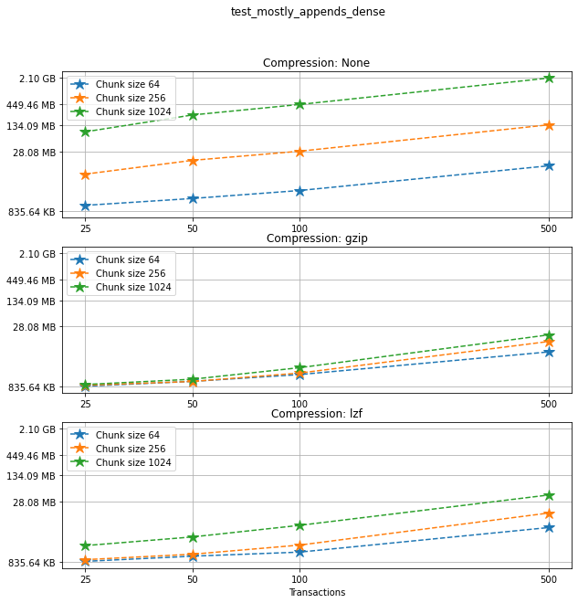

Creation times
~~~~~~~~~~~~~~

If we look at the creation times for these files, we have something like
this:

.. code:: python

    t_write = np.array([test['t_write'][-1] for test in testcase_5])
    fig_large_fraction_changes_times = plt.figure(figsize=(10,8))
    for i in range(ncomp):
        start = i*ncs*n
        for j in range(ncs):
            plt.plot(num_transactions[:n],
                     t_write[start+j*n:start+(j+1)*n],
                     'o--', ms=8,
                     label=f"Chunk size {chunk_sizes[start+j*n]}, {compression[start]}")

    # If you also with to plot information about the "no versions" test,
    # run the following lines:
    t_write_nv = np.array([test['t_write'][-1] for test in testcase_5_no_versions])
    for i in range(ncomp):
        start = i*ncs*n
        for j in range(ncs):
            plt.plot(num_transactions[:n],
                     t_write_nv[start+j*n:start+(j+1)*n],
                     '*-', ms=12,
                     label=f"Chunk size {chunk_sizes[start+j*n]}, {compression[start]}, No versioning")

    plt.xlabel("Transactions")
    plt.title(f"{testname} - creation times in seconds")
    plt.legend()
    plt.xticks(num_transactions[:n])
    plt.show()

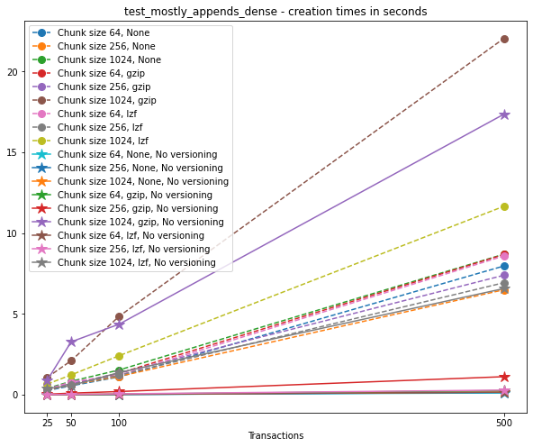

Again, the graphs below show, for each fixed number of transactions, the
time required to add new versions as the file is created.

.. code:: python

    fig_times, ax = plt.subplots(n+1, figsize=(14,20))
    fig_times.suptitle(f"{testname}: time to write each new version")

    for i in range(n):
        for test in testcase_5:
            if test['num_transactions'] == num_transactions[i]:
                t_write = np.array(test['t_write'][:-1])
                ax[i].plot(t_write,
                           label=f"chunk size {test['chunk_size']}, {test['compression']}")
                ax[i].legend(loc='upper left')

    # If you also with to plot information about the "no versions" test,
    # run the following lines:
    for test in testcase_5_no_versions:
        if test['num_transactions'] == num_transactions[i]:
            t_write = np.array(test['t_write'][:-1])
            ax[n].plot(t_write,
                       label=f"chunk size {test['chunk_size']}, {test['compression']}")
            ax[n].legend(loc='upper left')
            ax[n].set_title('No versioning')

    plt.xlabel("Number of transactions")
    plt.ylabel("Time (in seconds)")
    plt.show()

.. image:: Performance_tests-File_sizes_files/Performance_tests-File_sizes_184_0.png

Summary
~~~~~~~

This test case is unique for a few reasons. First, having a
two-dimensional dataset introduces new considerations, such as the
number of rows being added in each axis. For this test case, we have
only added (few) new rows to the first axis with each new version, and
this might explain why we don’t see an increase in the time required to
write new versions to file as the number of transactions grow. In
addition, we can see that in the case of 500 transactions, the creation
of the unversioned file can also take a hit in performance. These are
preliminary tests, and multidimensional datasets are still experimental
at this point in VersionedHDF5.
