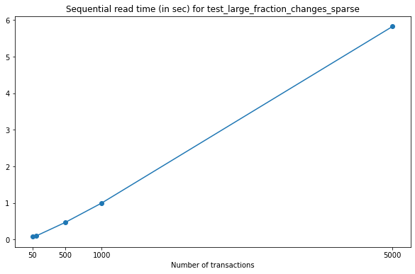
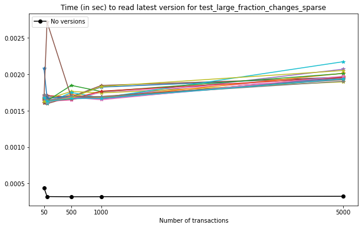
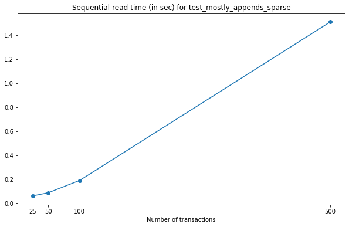
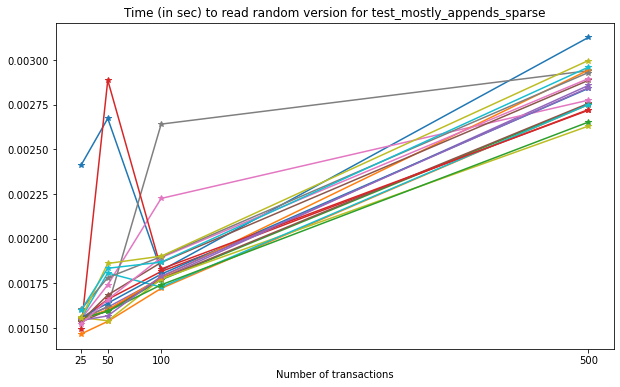
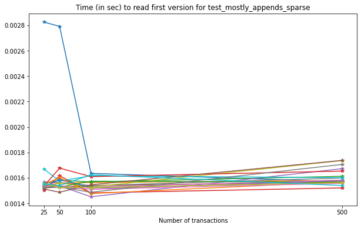
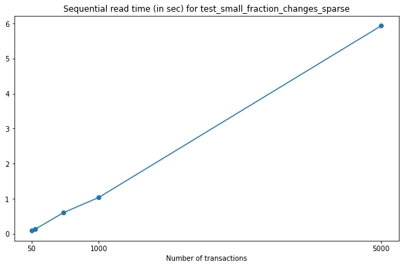
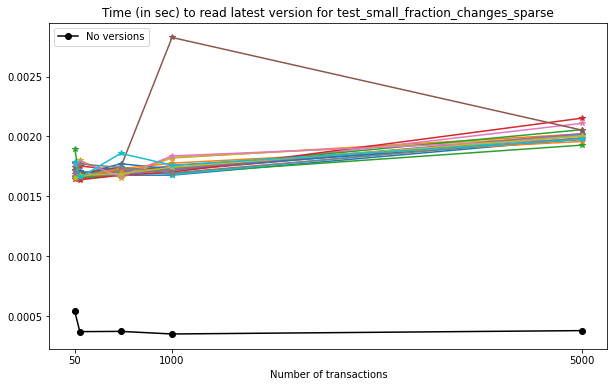
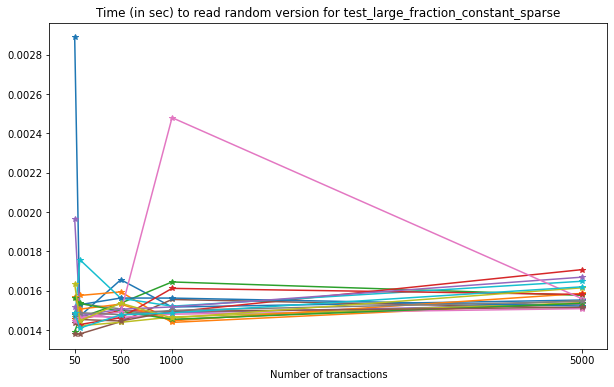

.. _performance_io:

I/O Performance for Versioned-HDF5 Files
========================================

For these tests, we have generated ``.h5`` data files using the
``generate_data.py`` script from the `VersionedHDF5
repository <https://github.com/deshaw/versioned-hdf5>`__, using the
standard options (:ref:`see more details in Performance<performance>`.)

We performed the following tests:

1. `Test Large Fraction Changes Sparse <#test-1-large-fraction-changes-sparse>`__
2. `Test Mostly Appends Sparse <#test-2-mostly-appends-sparse>`__
3. `Test Small Fraction Changes Sparse <#test-3-small-fraction-changes-sparse>`__
4. `Test Large Fraction Changes (Constant Array Size) Sparse <#test-4-large-fraction-changes-sparse-constant-size>`__
5. `Test Mostly Appends Dense <#test-5-mostly-appends-dense>`__

The ``.h5`` files used in these tests should be generated separately,
using the ``performance_tests.py`` script from ``analysis`` folder.

Setup
-----

.. code:: python

    import h5py
    import json
    import time
    import numpy as np
    import performance_tests
    import matplotlib.pyplot as plt
    from versioned_hdf5 import VersionedHDF5File

Test 1: Large fraction changes (sparse)
---------------------------------------

.. code:: python

    testname = "test_large_fraction_changes_sparse"

Reading in sequential mode
~~~~~~~~~~~~~~~~~~~~~~~~~~

For this test, we’ll read data from all versions in a file,
sequentially.

.. code:: python

    def read_times(filename):
        h5pyfile = h5py.File(filename, 'r+')
        vfile = VersionedHDF5File(h5pyfile)
        t0 = time.time()
        for vname in vfile._versions:
            if vname != '__first_version__':
                version = vfile[vname]
                group_key = list(version.keys())[0]
                val = version[group_key]['val']
        t = time.time()-t0
        h5pyfile.close()
        vfile.close()
        return t

To keep this test short, we’ll only analyze the tests using **no
compression**, and **chunk size** :math:`2^{14}`. Note that this can be
changed in the lines below if desired.

.. code:: python

    compression = "None"
    exponent = 14

Plotting with respect to the number of versions, we get the following:

.. code:: python

    rtimes = []
    num_transactions = [50, 100, 500, 1000, 5000]
    for n in num_transactions:
        filename = f"{testname}_{n}_{exponent}_{compression}.h5"
        rtimes.append(read_times(filename))

    fig = plt.figure(figsize=(10,6))

    plt.plot(num_transactions, rtimes, 'o-')
    selected = [0, 2, 3, 4]
    plt.xticks(np.array(num_transactions)[selected])
    plt.title(f"Sequential read time (in sec) for {testname}")
    plt.xlabel("Number of transactions")
    plt.show()

As expected, read times increase for files with a larger number of
versions, but the growth is close to linear.

Reading specific version
~~~~~~~~~~~~~~~~~~~~~~~~

For this test, we’ll compute the times required to read a specific
version from the versioned-hdf5 file.

**Note**. Although possible, it is not recommended to read versions
using integer indexing as the performance of reading versions from their
name it far superior.

In the code below you can choose to read a random version from the file,
or the version which is approximately at half of the version set (for
reproducibility reasons).

.. code:: python

    def read_version(filename, n):
        h5pyfile = h5py.File(filename, 'r+')
        vfile = VersionedHDF5File(h5pyfile)
        # If you want to choose a version at random,
        # N = len(vfile._versions.keys())
        # index = np.random.randint(0, N)
        index = n // 2
        vname = list(vfile._versions.keys())[index]
        t0 = time.time()
        version = vfile[vname]
        # It is not recommended to use integer indexing for
        # performance reasons:
        # e.g. version = vfile[-index]
        # This is much slower than reading from a version name.
        group_key = list(version.keys())[0]
        val = version[group_key]['val']
        t = time.time()-t0
        h5pyfile.close()
        vfile.close()
        return t

The next plot contains a set of 20 reads for the middle element of each
file (each line in the figure represents a run). It is expected that
there are variations in the read times, as this fluctuates with the
system load while running the test.

.. code:: python

    num_transactions = [50, 100, 500, 1000, 5000]

    fig = plt.figure(figsize=(10, 6))

    for _ in range(20):
        vtimes = []
        for i in range(5):
            n = num_transactions[i]
            filename = f"{testname}_{n}_{exponent}_{compression}.h5"
            vtimes.append(read_version(filename, n))
        plt.plot(num_transactions, vtimes, '*-')

    plt.xticks(np.array(num_transactions)[selected])
    plt.title(f"Time (in sec) to read specific version for {testname}")
    plt.xlabel("Number of transactions")
    plt.show()

.. image:: Performance_tests-IO_files/Performance_tests-IO_21_0.png

From this test, we can see that reading an arbitrary version from the
file is very slightly affected by the number of versions in the file.

Reading first version vs. reading latest version
~~~~~~~~~~~~~~~~~~~~~~~~~~~~~~~~~~~~~~~~~~~~~~~~

Next, we’ll compare the times necessary to read the first version and
the latest version on each file.

.. code:: python

    def read_first(filename):
        h5pyfile = h5py.File(filename, 'r+')
        vfile = VersionedHDF5File(h5pyfile)
        t0 = time.time()
        version = vfile['initial_version']
        group_key = list(version.keys())[0]
        val = version[group_key]['val']
        t = time.time()-t0
        h5pyfile.close()
        vfile.close()
        return t

.. code:: python

    num_transactions = [50, 100, 500, 1000, 5000]

    fig = plt.figure(figsize=(10, 6))

    for _ in range(20):
        ftimes = []
        for i in range(5):
            n = num_transactions[i]
            filename = f"{testname}_{n}_{exponent}_{compression}.h5"
            ftimes.append(read_first(filename))
        plt.plot(num_transactions, ftimes, '*-')

    plt.xticks(np.array(num_transactions)[selected])
    plt.title(f"Time (in sec) to read first version for {testname}")
    plt.xlabel("Number of transactions")
    plt.show()

.. image:: Performance_tests-IO_files/Performance_tests-IO_26_0.png

Note that, on average, the time required to read the contents of the
first version written to the file do not increase significantly with the
number of versions stored in the file.

The Versioned HDF5 file stores the latest version as the last to be
stored in the file. For comparison, we will also measure reading times
for files generated without versioning (i.e. with no use of Versioned
HDF5). Note that these should be similar data.

.. code:: python

    def read_last(filename):
        h5pyfile = h5py.File(filename, 'r+')
        vfile = VersionedHDF5File(h5pyfile)
        t0 = time.time()
        #
        # Current version is 0
        # This is the same as
        # version = vfile[vfile._versions.attrs['current_version']]
        #
        version = vfile[0]
        group_key = list(version.keys())[0]
        val = version[group_key]['val']
        t = time.time()-t0
        h5pyfile.close()
        vfile.close()
        return t

.. code:: python

    def read_no_versions(filename):
        h5pyfile = h5py.File(filename, 'r+')
        t0 = time.time()
        val = h5pyfile[list(h5pyfile.keys())[0]]['val']
        t = time.time()-t0
        h5pyfile.close()
        return t

.. code:: python

    num_transactions = [50, 100, 500, 1000, 5000]

    fig = plt.figure(figsize=(10,6))

    # We only do one run for the unversioned files.
    notimes = []
    for i in range(5):
        n = num_transactions[i]
        filename = f"{testname}_{n}_{exponent}_{compression}_no_versions.h5"
        notimes.append(read_no_versions(filename))
    plt.plot(num_transactions, notimes, 'ko-', ms=6)
    plt.legend(["No versions"], loc="upper left")

    for _ in range(20):
        ltimes = []
        for i in range(5):
            n = num_transactions[i]
            filename = f"{testname}_{n}_{exponent}_{compression}.h5"
            ltimes.append(read_last(filename))
        plt.plot(num_transactions, ltimes, '*-')

    plt.xticks(np.array(num_transactions)[selected])
    plt.title(f"Time (in sec) to read latest version for {testname}")
    plt.xlabel("Number of transactions")
    plt.show()

In this case, we can see that:

- on average, reading the latest version on a VersionedHDF5File is ~5x slower than reading an unversioned file;
- the time required to read the latest version from a Versioned HDF5 file increases modestly with the number of versions stored in the file.

Test 2: Mostly appends (Sparse)
-------------------------------

.. code:: python

    testname = "test_mostly_appends_sparse"

Once again, for shortness, we’ll only consider

.. code:: python

    compression = "None"
    exponent = 14

Reading in sequential mode
~~~~~~~~~~~~~~~~~~~~~~~~~~

If we read data from each version of the file, sequentially, we obtain
the following:

.. code:: python

    rtimes = []
    num_transactions = [25, 50, 100, 500]
    for n in num_transactions:
        filename = f"{testname}_{n}_{exponent}_{compression}.h5"
        rtimes.append(read_times(filename))

    fig = plt.figure(figsize=(10,6))

    plt.plot(num_transactions, rtimes, 'o-')
    selected = [0, 1, 2, 3]
    plt.xticks(np.array(num_transactions)[selected])
    plt.title(f"Sequential read time (in sec) for {testname}")
    plt.xlabel("Number of transactions")
    plt.show()

In this case, we can see that the increase in the time required to read
the datasets from the VersionedHDF5File grows quadratically with the
number of transactions stored in the file. This is consistent with the
increase in the size of the dataset, which also grows quickly with each
new version commited to file.

Reading specific version
~~~~~~~~~~~~~~~~~~~~~~~~

Now, let’s see the times required to read a specific version from each
file.

.. code:: python

    num_transactions = [25, 50, 100, 500]

    fig = plt.figure(figsize=(10,6))

    for _ in range(20):
        vtimes = []
        for i in range(4):
            n = num_transactions[i]
            filename = f"{testname}_{n}_{exponent}_{compression}.h5"
            vtimes.append(read_version(filename, n))
        plt.plot(num_transactions, vtimes, '*-')

    plt.xticks(num_transactions)
    plt.title(f"Time (in sec) to read random version for {testname}")
    plt.xlabel("Number of transactions")
    plt.show()

In this case, we can see a very clear increase in the time required to
read versions from the file as the number of transactions increases.
Again, this can be explained in part by the size of the datasets being
read from file, as they grow in size with each new transaction.

Reading first version vs. reading latest version
~~~~~~~~~~~~~~~~~~~~~~~~~~~~~~~~~~~~~~~~~~~~~~~~

Looking at the times required to read the first version and the latest
version of the files, we get the following results.

.. code:: python

    num_transactions = [25, 50, 100, 500]

    fig = plt.figure(figsize=(10,6))

    for _ in range(20):
        ftimes = []
        for i in range(4):
            n = num_transactions[i]
            filename = f"{testname}_{n}_{exponent}_{compression}.h5"
            ftimes.append(read_first(filename))
        plt.plot(num_transactions, ftimes, '*-')

    plt.xticks(num_transactions)
    plt.title(f"Time (in sec) to read first version for {testname}")
    plt.xlabel("Number of transactions")
    plt.show()

In this case, there is no significant increase in the time required to
read the first version of the file as the number of transactions
increases.

For the latest version, the results are as follows.

.. code:: python

    num_transactions = [25, 50, 100, 500]

    fig = plt.figure(figsize=(10,6))

    notimes = []
    for i in range(4):
        n = num_transactions[i]
        filename = f"{testname}_{n}_{exponent}_{compression}_no_versions.h5"
        notimes.append(read_no_versions(filename))
    plt.plot(num_transactions, notimes, 'ko-', ms=6)
    plt.legend(["No versions"], loc="upper left")

    for _ in range(20):
        ltimes = []
        for i in range(4):
            n = num_transactions[i]
            filename = f"{testname}_{n}_{exponent}_{compression}.h5"
            ltimes.append(read_last(filename))
        plt.plot(num_transactions, ltimes, '*-')

    plt.xticks(np.array(num_transactions)[selected])
    plt.title(f"Time (in sec) to read latest version for {testname}")
    plt.xlabel("Number of transactions")
    plt.show()

.. image:: Performance_tests-IO_files/Performance_tests-IO_50_0.png

Note that here we can see the impact of storing all versions of the
growing datasets on the VersionedHDF5File. While the unversioned file
can be read in constant time, irrespective of the number of transactions
commited, the versioned file suffers a slight drop in read performance
(for 500 transactions, this amounts to an average difference of ~10x in
seconds.)

Test 3: Small Fraction Changes (Sparse)
---------------------------------------

.. code:: python

    testname = "test_small_fraction_changes_sparse"

Reading in sequential mode
~~~~~~~~~~~~~~~~~~~~~~~~~~

Once again, we only consider

.. code:: python

    compression = "None"
    exponent = 14

Reading all versions in a file sequentially gives the following result.

.. code:: python

    rtimes = []
    num_transactions = [50, 100, 500, 1000, 5000]
    for n in num_transactions:
        filename = f"{testname}_{n}_{exponent}_{compression}.h5"
        rtimes.append(read_times(filename))

    fig = plt.figure(figsize=(10,6))

    plt.plot(num_transactions, rtimes, 'o-')
    selected = [0, 3, 4]
    plt.xticks(np.array(num_transactions)[selected])
    plt.title(f"Sequential read time (in sec) for {testname}")
    plt.xlabel("Number of transactions")
    plt.show()

In this test, the sequential read times grow linearly with respect to
the number of transactions commited to file.

Reading specific version
~~~~~~~~~~~~~~~~~~~~~~~~

The times required to read a specific version from each file are
similarly slightly affected by the number of existing versions in the
file, as can be seen below.

.. code:: python

    num_transactions = [50, 100, 500, 1000, 5000]

    fig = plt.figure(figsize=(10,6))

    for _ in range(20):
        vtimes = []
        for i in range(5):
            n = num_transactions[i]
            filename = f"{testname}_{n}_{exponent}_{compression}.h5"
            vtimes.append(read_version(filename, n))
        plt.plot(num_transactions, vtimes, '*-')

    plt.xticks(np.array(num_transactions)[selected])
    plt.title(f"Time (in sec) to read random version for {testname}")
    plt.xlabel("Number of transactions")
    plt.show()

.. image:: Performance_tests-IO_files/Performance_tests-IO_62_0.png

In this test, we can see there is again a slight increase in the time
required to read a given version from each file as the number of
transactions grows, similar to what we observe in
``test_large_fraction_changes_sparse``.

Reading first version vs. reading latest version
~~~~~~~~~~~~~~~~~~~~~~~~~~~~~~~~~~~~~~~~~~~~~~~~

Reading the first version from each file results in the following:

.. code:: python

    num_transactions = [50, 100, 500, 1000, 5000]

    fig = plt.figure(figsize=(10,6))

    for _ in range(20):
        ftimes = []
        for i in range(5):
            n = num_transactions[i]
            filename = f"{testname}_{n}_{exponent}_{compression}.h5"
            ftimes.append(read_first(filename))
        plt.plot(num_transactions, ftimes, '*-')

    plt.xticks(np.array(num_transactions)[selected])
    plt.title(f"Time (in sec) to read first version for {testname}")
    plt.xlabel("Number of transactions")
    plt.show()

.. image:: Performance_tests-IO_files/Performance_tests-IO_66_0.png

Comparing reading the latest version from a Versioned HDF5 file with an
unversioned file (black line in the plot) results in the following:

.. code:: python

    num_transactions = [50, 100, 500, 1000, 5000]

    fig = plt.figure(figsize=(10,6))

    notimes = []
    for i in range(5):
        n = num_transactions[i]
        filename = f"{testname}_{n}_{exponent}_{compression}_no_versions.h5"
        notimes.append(read_no_versions(filename))
    plt.plot(num_transactions, notimes, 'ko-', ms=6)
    plt.legend(["No versions"], loc="upper left")

    for _ in range(20):
        ltimes = []
        for i in range(5):
            n = num_transactions[i]
            filename = f"{testname}_{n}_{exponent}_{compression}.h5"
            ltimes.append(read_last(filename))
        plt.plot(num_transactions, ltimes, '*-')

    plt.xticks(np.array(num_transactions)[selected])
    plt.title(f"Time (in sec) to read latest version for {testname}")
    plt.xlabel("Number of transactions")
    plt.show()

In this case, we can see that:

- reading the latest version is not as performant as reading an unversioned file;
- the time required to read the latest version from a Versioned HDF5 file increases modestly with the number of versions stored in the file;
- these results are similar to the ones obtained in ``test_large_fraction_changes_sparse``.

Test 4: Large Fraction Changes (Sparse) - Constant Size
-------------------------------------------------------

.. code:: python

    testname = "test_large_fraction_constant_sparse"

Once more,

.. code:: python

    compression = "None"
    exponent = 14

Reading in sequential mode
~~~~~~~~~~~~~~~~~~~~~~~~~~

Reading all versions from each file sequentially gives the following.

.. code:: python

    rtimes = []
    num_transactions = [50, 100, 500, 1000, 5000]

    fig = plt.figure(figsize=(10,6))

    for n in num_transactions:
        filename = f"{testname}_{n}_{exponent}_{compression}.h5"
        rtimes.append(read_times(filename))

    plt.plot(num_transactions, rtimes, 'o-')
    selected = [0, 2, 3, 4]
    plt.xticks(np.array(num_transactions)[selected])
    plt.title(f"Sequential read time (in sec) for {testname}")
    plt.xlabel("Number of transactions")
    plt.show()

.. image:: Performance_tests-IO_files/Performance_tests-IO_76_0.png

Again, the time required to read all versions in each file grows
linearly with the number of transactions stored in each file.

Reading specific version
~~~~~~~~~~~~~~~~~~~~~~~~

The times required to read a specific version from each file are
similarly unnaffected by the number of existing versions in the file.

.. code:: python

    num_transactions = [50, 100, 500, 1000, 5000]

    fig = plt.figure(figsize=(10,6))

    for _ in range(20):
        vtimes = []
        for i in range(5):
            n = num_transactions[i]
            filename = f"{testname}_{n}_{exponent}_{compression}.h5"
            vtimes.append(read_version(filename, n))
        plt.plot(num_transactions, vtimes, '*-')

    plt.xticks(np.array(num_transactions)[selected])
    plt.title(f"Time (in sec) to read random version for {testname}")
    plt.xlabel("Number of transactions")
    plt.show()

From this test, we can see that reading an arbitrary version from the
file is only very slightly affected by the number of versions in the
file.

Reading first version vs. reading latest version
~~~~~~~~~~~~~~~~~~~~~~~~~~~~~~~~~~~~~~~~~~~~~~~~

Finally, let’s read the first version of each file.

.. code:: python

    num_transactions = [50, 100, 500, 1000, 5000]

    fig = plt.figure(figsize=(10,6))

    for _ in range(20):
        ftimes = []
        for i in range(5):
            n = num_transactions[i]
            filename = f"{testname}_{n}_{exponent}_{compression}.h5"
            ftimes.append(read_first(filename))
        plt.plot(num_transactions, ftimes, '*-')

    plt.xticks(np.array(num_transactions)[selected])
    plt.title(f"Time (in sec) to read first version for {testname}")
    plt.xlabel("Number of transactions")
    plt.show()

.. image:: Performance_tests-IO_files/Performance_tests-IO_84_0.png

Comparing versioned and unversioned files for the latest version results
in the following:

.. code:: python

    num_transactions = [50, 100, 500, 1000, 5000]

    fig = plt.figure(figsize=(10,6))

    notimes = []
    for i in range(5):
        n = num_transactions[i]
        filename = f"{testname}_{n}_{exponent}_{compression}_no_versions.h5"
        notimes.append(read_no_versions(filename))
    plt.plot(num_transactions, notimes, 'ko-', ms=6)
    plt.legend(["No versions"], loc="upper left")

    for _ in range(50):
        ltimes = []
        for i in range(5):
            n = num_transactions[i]
            filename = f"{testname}_{n}_{exponent}_{compression}.h5"
            ltimes.append(read_last(filename))
        plt.plot(num_transactions, ltimes, '*-')

    plt.xticks(np.array(num_transactions)[selected])
    plt.title(f"Time (in sec) to read latest version for {testname}")
    plt.xlabel("Number of transactions")
    plt.show()

.. image:: Performance_tests-IO_files/Performance_tests-IO_86_0.png

In this case, we can see that:

- reading the latest version is not as performant as reading an unversioned file;
- the time required to read the latest version from a Versioned HDF5 file increases very modestly with the number of versions stored in the file.

Test 5: Mostly appends (Dense)
------------------------------

**Note that this test includes a two-dimensional dataset.**

.. code:: python

    testname = "test_mostly_appends_dense"

Since this is a two-dimensional dataset, we have observed that a chunk
size like the one used in previous examples will generate very large
files, and will show a poor performance overall. In this case, we have
chosen a chunk size of :math:`2^8` as a sensible value for the current
tests.

.. code:: python

    compression = "None"
    exponent = 8

Reading in sequential mode
~~~~~~~~~~~~~~~~~~~~~~~~~~

When we read all versions in sequential mode for this test, the results
are as follows.

.. code:: python

    rtimes = []
    num_transactions = [25, 50, 100, 500]
    for n in num_transactions:
        filename = f"{testname}_{n}_{exponent}_None.h5"
        rtimes.append(read_times(filename))

    fig = plt.figure(figsize=(10,6))

    plt.plot(num_transactions, rtimes, 'o-')
    selected = [0, 1, 2, 3]
    plt.xticks(np.array(num_transactions)[selected])
    plt.title(f"Sequential read time (in sec) for {testname}")
    plt.xlabel("Number of transactions")
    plt.show()

.. image:: Performance_tests-IO_files/Performance_tests-IO_95_0.png

Note that this behaviour is not directly comparable to
``test_mostly_appends_sparse``, as we have used a different chunk size
and the dataset contains two-dimensional data. In this case, the
increase in the time needed to read the dataset is close to linear.

Reading specific version
~~~~~~~~~~~~~~~~~~~~~~~~

Now, let’s see the times required to read a specific version from each
file.

.. code:: python

    num_transactions = [25, 50, 100, 500]

    fig = plt.figure(figsize=(10,6))
    for _ in range(20):
        vtimes = []
        for i in range(4):
            n = num_transactions[i]
            filename = f"{testname}_{n}_{exponent}_{compression}.h5"
            vtimes.append(read_version(filename, n))
        plt.plot(num_transactions, vtimes, '*-')

    plt.xticks(num_transactions)
    plt.title(f"Time (in sec) to read random version for {testname}")
    plt.xlabel("Number of transactions")
    plt.show()

.. image:: Performance_tests-IO_files/Performance_tests-IO_99_0.png

For this case, there is no marked increase in the time required to read
a specific version from the file with respect to the number of versions.

Reading first version vs. reading latest version
~~~~~~~~~~~~~~~~~~~~~~~~~~~~~~~~~~~~~~~~~~~~~~~~

Reading the first version of each of these files results in the
following.

.. code:: python

    num_transactions = [25, 50, 100, 500]

    fig = plt.figure(figsize=(10,6))
    for _ in range(20):
        ftimes = []
        for i in range(4):
            n = num_transactions[i]
            filename = f"{testname}_{n}_{exponent}_{compression}.h5"
            ftimes.append(read_first(filename))
        plt.plot(num_transactions, ftimes, '*-')

    plt.xticks(num_transactions)
    plt.title(f"Time (in sec) to read first version for {testname}")
    plt.xlabel("Number of transactions")
    plt.show()

.. image:: Performance_tests-IO_files/Performance_tests-IO_103_0.png

For the latest version, once again comparing with the unversioned file,
we have the following results:

.. code:: python

    num_transactions = [25, 50, 100, 500]

    fig = plt.figure(figsize=(10,6))

    notimes = []
    for i in range(4):
        n = num_transactions[i]
        filename = f"{testname}_{n}_{exponent}_{compression}_no_versions.h5"
        notimes.append(read_no_versions(filename))

    plt.plot(num_transactions, notimes, 'ko-', ms=6)
    plt.legend(["No versions"], loc="upper left")

    for _ in range(20):
        ltimes = []
        for i in range(4):
            n = num_transactions[i]
            filename = f"{testname}_{n}_{exponent}_{compression}.h5"
            ltimes.append(read_last(filename))
        plt.plot(num_transactions, ltimes, '*-')

    plt.xticks(np.array(num_transactions)[selected])
    plt.title(f"Time (in sec) to read latest version for {testname}")
    plt.xlabel("Number of transactions")
    plt.show()

.. image:: Performance_tests-IO_files/Performance_tests-IO_105_0.png

In this case:

- There is no marked increase in the time required to read the latest version with respect to the number of versions in each file;
- Reading a versioned file is, on average, 5x slower than reading a file containing only the last version of the data.

Summary
-------

-  ``test_mostly_appends_sparse`` shows the worst performance, with a
   considerable increase in the times required to read the latest
   version with respect to the number of transactions in the file.
-  ``test_large_fraction_changes_sparse``,
   ``test_small_fraction_changes_sparse`` and
   ``test_large_fraction_constant_sparse`` show better results in those
   same tests.
-  ``test_mostly_appends_dense`` includes a two-dimensional dataset, and
   this does not seem to hinder performance of the versioning beyond
   what is observed in other one-dimensional tests.
-  The same behaviour can be observed when reading a specific version
   from each file.
-  This reflects what we observe in file sizes and can be partially
   explained by the increase in the dimension of the arrays which are
   stored at each version.
-  Reading the first version is, in all tests, seemingly unaffected by
   the number of transactions involved in the file.
